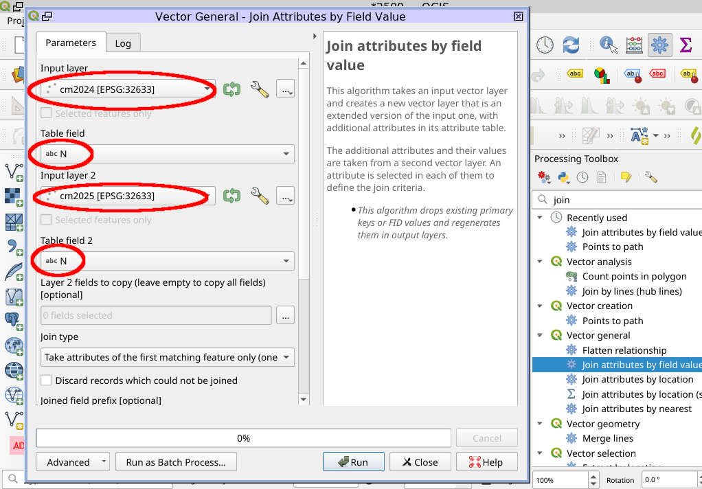
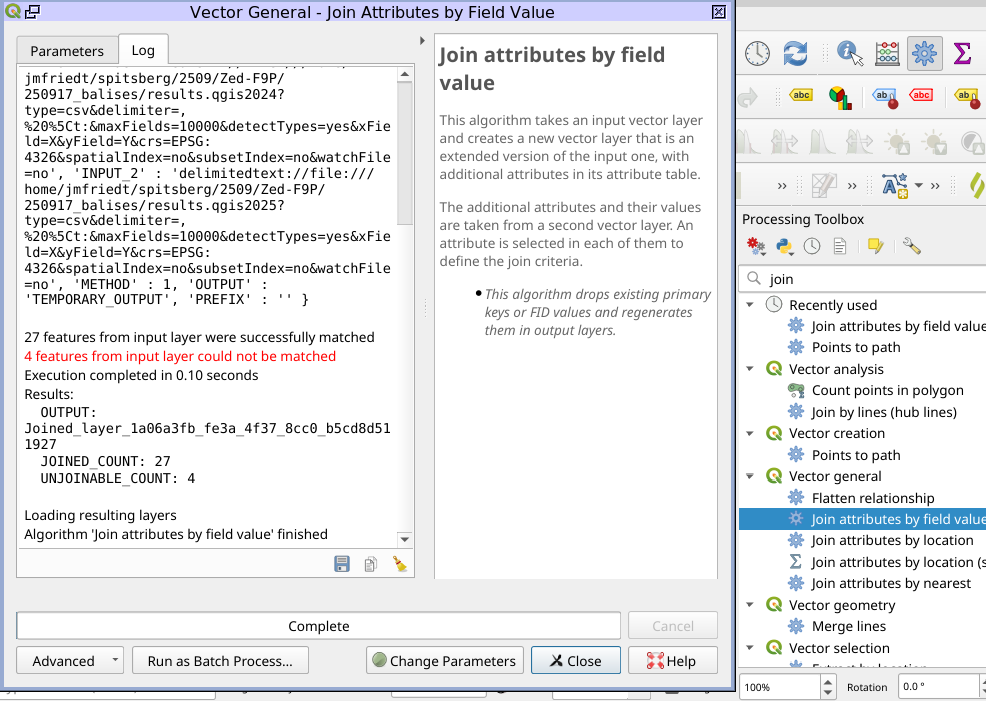
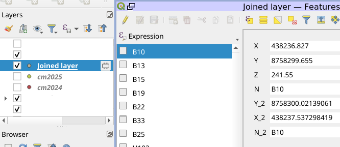
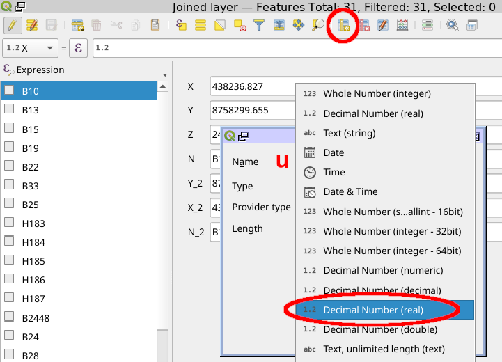
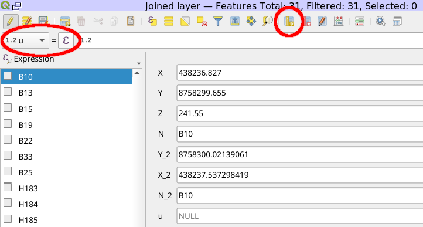
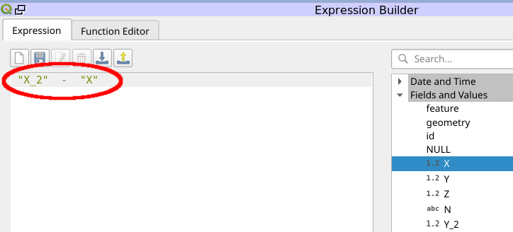
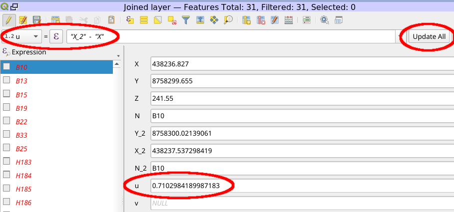
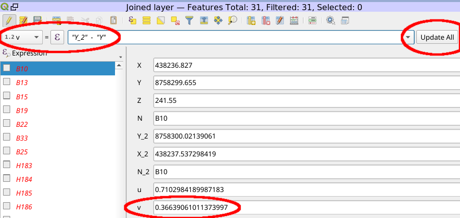
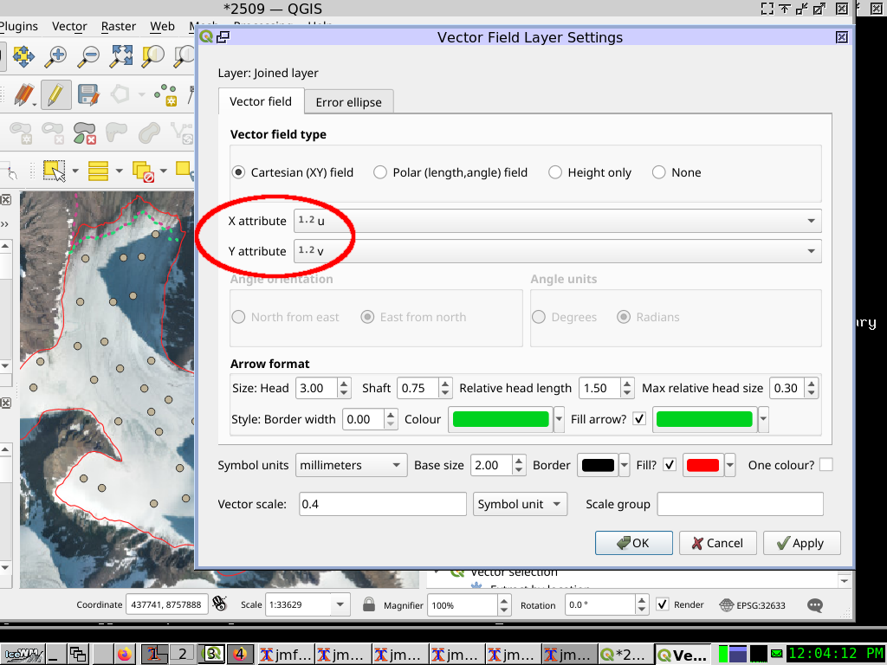
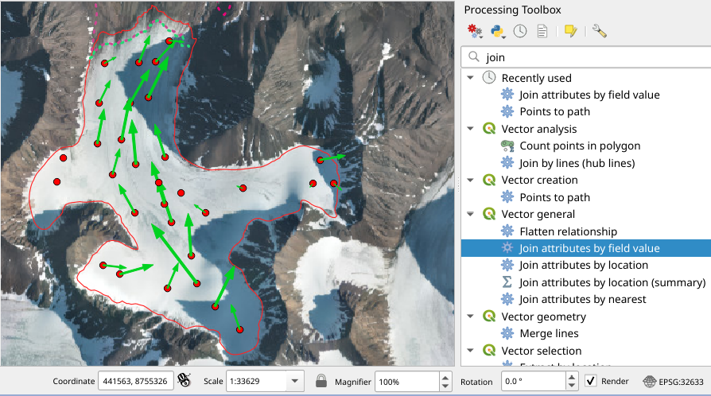

## Displaying a vector point displacement field using QGIS

The objective is to display a vector field map from successive GNSS measurements of
similar points (ablation stakes) collected on a flowing glacier.

Load the text delimited files ``results.qgis2024`` and ``results.qgis2025``, CRS is UTM33N,
space delimited, with ``X`` and ``Y`` fields for cartesian coordinates and ``N`` for the 
stake name.

``Processing`` -> ``Toolbox`` -> ``Vector General`` -> ``Join attributes by field value``
and select the two layers with ``X``, ``Y`` fields collected during different years but a common
``N`` name field.

Four fields will not match, but all others will:

The result is a new temporary layer with attributes ``X`` and ``Y`` for the first vector points and
``X2`` and ``Y2`` for the second vector points.

Open the attribute table and create new fields ``u`` and ``v`` (displacement vector coordinates)
as real numbers (floating point values).

Fill the ``u`` field with ``"X2"-"X"`` and ``Update All``. 

Same for ``v`` with ``"Y2"-"Y"`` using either the equation editor, or in the free text field.

Install plugin ``Vector field layer manager`` found at https://plugins.qgis.org/plugins/VectorFieldRenderer/ (or in QGIS: Plugins -> Install and Manage Plugins and select the appropriate name)

The result should look like

